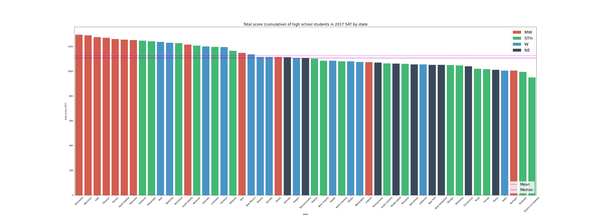
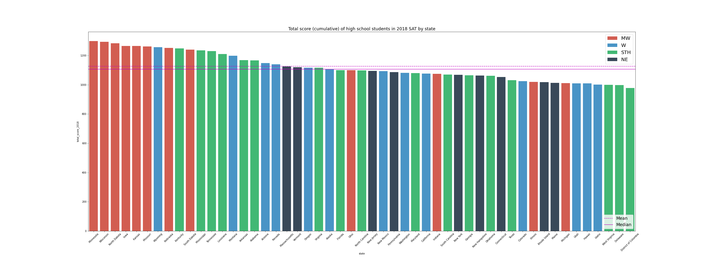
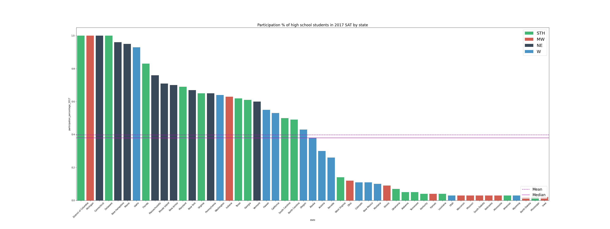
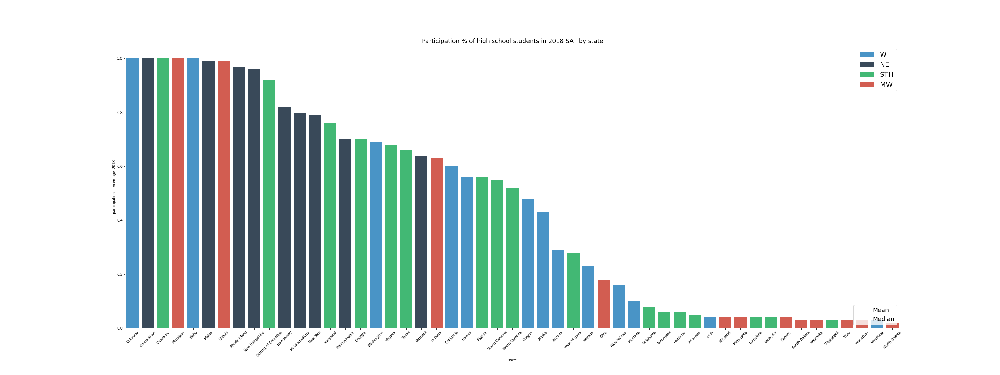
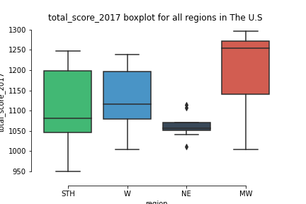
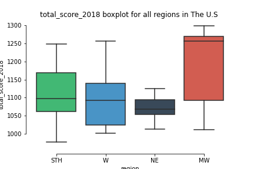
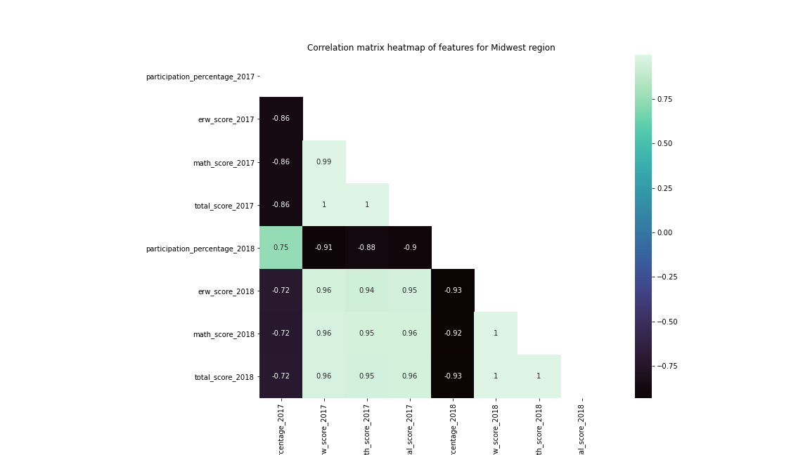
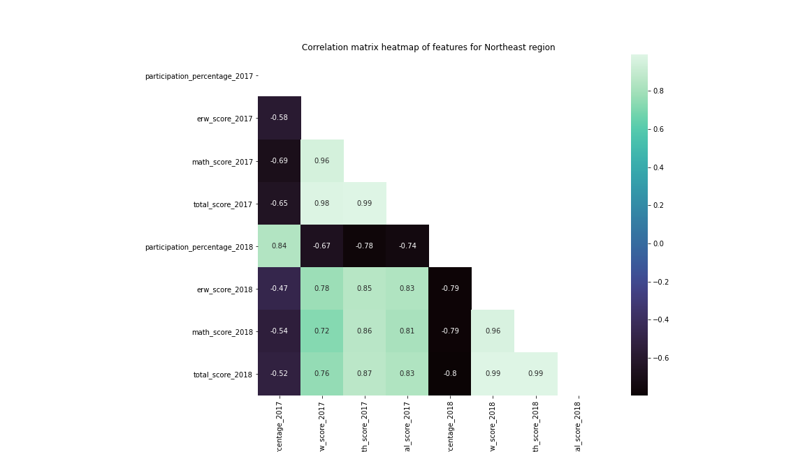
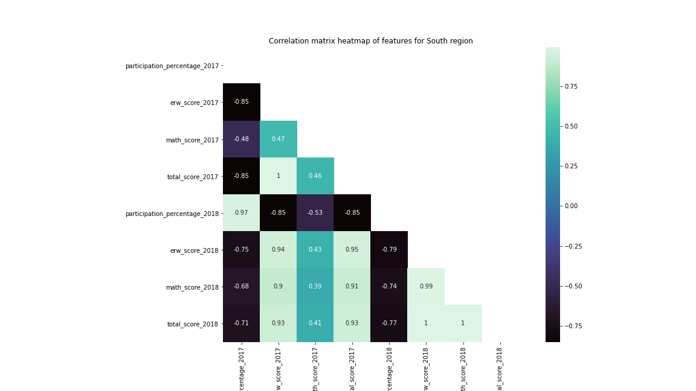
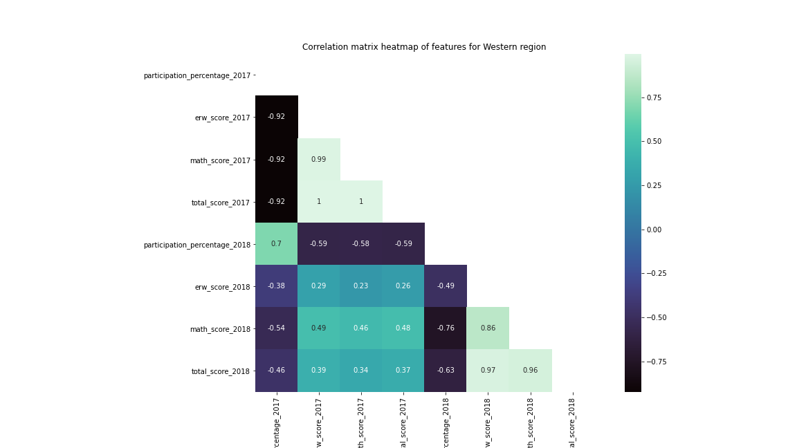

# Project 1: Data exploration for SAT testing across Standardized Test Analysis

### Problem Statement

We often hypothesize that students from the northeast receive a better education compared to students from any of the other three regions in the U.S. This project seeks to see if a relationship exists between student SAT scores and the different regions in the U.S to support or oppose a the notion of a particular region being academically superior  than the others.

## Background 

The U.S Census Bureau determines that The United States is divided into four main regions which are Northeast, Midwest, South and West. There are additional divisions inside each region; the following list demostrates all the regions and divisions. ([*source*](https://www2.census.gov/geo/pdfs/maps-data/maps/reference/us_regdiv.pdf))

* Northeast:
    * Division I (New England):
        * Connecticut 
        * Maine
        * Massachusetts 
        * New Hampshire
        * Rhode Island
        * Vermont
    * Division II (Middle Atlantic):
        * New Jersey
        * New York
        * Pennsylvania
* Midwest
    * Division III (East North Central):
        * Indiana
        * Illinois
        * Michigan
        * Ohio
        * Wisconsin
    * Division IV (West North Central):
        * Iowa 
        * Kansas
        * Minnesota
        * Missouri
        * Nebraska
        * North Dakota
        * South Dakota
* South
    * Division V (South Atlantic):
        * Delaware
        * District of Columbia
        * Florida
        * Georgia
        * Maryland
        * North Carolina
        * South Carolina 
        * Virginia
        * West Virginia
    * Division VI (East South Central):
        * Alabama
        * Kentucky 
        * Mississippi
        * Tennessee
    * Division VII (West South Central):
        * Arkansas
        * Louisiana
        * Oklahoma
        * Texas
    
* West
    * Division VIII (Mountain):
        * Arizona
        * Colorado
        * Idaho
        * New Mexico
        * Montana
        * Utah
        * Nevada
        * Wyoming
    * Division IX (Pacific):
        * Alaska
        * California
        * Hawaii 
        * Oregon
        * Washington

There has been a a long lasting perspective that the Northeast region tend to have a better educational system which ultimately allows students to excell in their academic journey; According to the American School University magazine,  five of the top 10 most educated ranked states belong to the Northeast region ([*read more*](https://www.asumag.com/research/top-10s/article/21122104/the-most-educated-states-in-the-usa)). Furthermore, there exists the argument that try to demostrate that the states with the most educated populations tend to retain students from their own college systems. ([*read more*](https://www.usnews.com/news/best-states/slideshows/the-10-most-educated-states-in-the-us)).

### Data Dictionary

|Feature|Type|Dataset|Description|
|---|---|---|---|
|state|object|SAT 2017/2018 | state that is considered part of the U.S.| 
|participation_percentage_2017|float|SAT 2017/2018 |  percentage graduates in the class of 2017 that took the SAT during highschool.| 
|erw_score_2017|int|SAT 2017/2018 |  scores for the 2017 Evidence-Based Readingand Writing(ERW) section of the SAT ranging from 200 to 800.| 
|math_score_2017|int|SAT 2017/2018 |  scores for the 2017 Mathematics section of the SAT ranging from 200 to 800.|
|total_score_2017|int|SAT 2017/2018 |  total scores for the 2017 of the SAT ranging from 400 to 1600.|
|participation_percentage_2018|float|SAT 2017/2018 |  percentage graduates in the class of 2018 that took the SAT during highschool.| 
|erw_score_2018|int|SAT 2017/2018 |  scores for the 2018 Evidence-Based Readingand Writing(ERW) section of the SAT ranging from 200 to 800.| 
|math_score_2018|int|SAT 2017/2018 |  scores for the 2018 Mathematics section of the SAT ranging from 200 to 800.|
|total_score_2018|int|SAT 2017/2018 |  total scores for the 2018 of the SAT ranging from 400 to 1600.|
|region|object|SAT 2017/2018 | region according to the U.S Census Bureau.| 

### Summary of analysis

**Comment**: 

All states that belong to the NE region are above the median and mean of the Nation, this demostrates the high percetage of participation that that regions tends to have.

**Comment**: 

All states that belong to the NE region are above the median and mean of the Nation, this demostrates the high percetage of participation that that regions tends to have.   

**Comment**: 

All states that belong to the NE region are below the median and mean of the Nation, this demostrates the low performance in cumulative SAT score.  

**Comment**: 

All states that belong to the NE region are below the median and mean of the Nation, this demostrates the low performance in cumulative SAT score. 

**Comment:**

The boxplot allows us to see the outliers that exist in the NE region. Futhermore we can see that there exists a really small value for the standard deviation for the NE region, and that the median for NE is smaller to the median of all the other regions. 

**Comment:**

The boxplot allows us to see that compared to the `total_score_2017` feature for NE, in the case for `total_score_2018` outliers that exist in the NE region. Futhermore we can see that there exists a really small value for the standard deviation for the NE region, and that the median for NE is smaller to the median of all the other regions. 

**Comment:**

As previoulsy mentioned, the features of `participation_percentage_2017` and `participation_percentage_2018` seemed to follow some relationship with the features regarding the scores in the SAT. The heatmap demonstrates that there exists a negative correlation of ~.86 between the `participation_percentage_2017` feature of the Midwestern region with the SAT score metrics, and that there exists a negative correlation of ~.92 between the  `participation_percentage_2018` feature of the Midwestern region with the SAT score metrics. 

**Comment:**

As previoulsy mentioned, the features of `participation_percentage_2017` and `participation_percentage_2018` seemed to follow some relationship with the features regarding the scores in the SAT. The heatmap demonstrates that there exists a negative correlation of ~.64 between the `participation_percentage_2017` feature of the Midwestern region with the SAT score metrics, and that there exists a negative correlation of ~.79 between the  `participation_percentage_2018` feature of the Midwestern region with the SAT score metrics. 

**Comment:**

As previoulsy mentioned, the features of `participation_percentage_2017` and `participation_percentage_2018` seemed to follow some relationship with the features regarding the scores in the SAT. The heatmap demonstrates that there exists a negative correlation of ~.72 between the `participation_percentage_2017` feature of the Southern region with the SAT score metrics, and that there exists a negative correlation of ~.76 between the  `participation_percentage_2018` feature of the Southern region with the SAT score metrics.

**Observation/Comment:**

As previoulsy mentioned, the features of `participation_percentage_2017` and `participation_percentage_2018` seemed to follow some relationship with the features regarding the scores in the SAT. The heatmap demonstrates that there exists a negative correlation of ~.72 between the `participation_percentage_2017` feature of the Western region with the SAT score metrics, and that there exists a negative correlation of ~.76 between the  `participation_percentage_2018` feature of the Western region with the SAT score metrics.

## Conclusions and Recommendations

After the data analysis and visual support provided by the barcharts representing the standing of different states according to the `total_score_2017` and `total_score_2018` attribute the problem statement was put to the test, due to the fact that by analyzing both barcharts not a single state considered part of the NE region was part of the top 10 states with the highest value for both `total_score_2017` and `total_score_2017`.

Futhermore, when analyzing the boxplots of both the `total_score_2017` and `total_score_2018` with the different regions the median for the NE region was a lower value compared to the median of all the other regions. 

Moreover, after analyzing the correlations that exist between all the attributes in the data frame a negative realtionship between the 2018 and 2019 attributes measuring the highschoolers performance on the SAT test and the participation percentage for each region exist; any increase in participation percentage in any region indicated a decrease in performace in SAT scores. This particular insight gained more relevance once it was clear that the region with overall most negative pearson correlation was NE, and by analyzing the barcharts ranking the percentage of participation of each state all states from the NE region it is evidente that all the states stay above the median (for both years). 

One of the key takeaways that the data analysis was able to provide was the fact that there exist a considerable degree of difference when it comes to regional performance in SAT scores. In addition, there seems to be a negative relationship between regional performance in SAT scores and the percentage of participation. Even though the data insights previously mentioned might create the perspective that the notion that NE cannot be considered as more "educated", I would recommend to expand the analisys to other types of standarized testing and metrics that take into consideration a population that is already part of the higher education.   